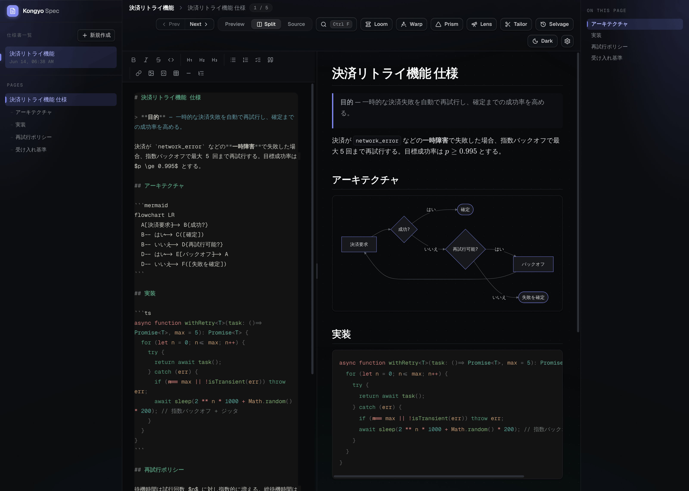

# Kongyo Spec

AI 駆動開発のためのデスクトップ Markdown 仕様エディタ。1 つの仕様書を見出し単位の「ページ」に分割して扱い、GFM・コードハイライト・数式・図をその場でプレビューしながら、LLM で執筆・レビュー・計画づくりを支援します。

<p align="center">
  
</p>

<p align="center"><sub>分割ビュー — 左でソースを編集し、右で GFM・Mermaid 図・コードハイライト・数式をライブプレビュー</sub></p>

## 特徴

- **リッチプレビュー** — GFM、Shiki（コードハイライト）、KaTeX（数式）、Mermaid（図）に対応。ソース / プレビュー / 分割の 3 モード。
- **仮想ページ** — H1・H2 見出しで仕様書を自動的にページに分割し、サイドバー + アウトラインから移動。
- **AI アシスト**（Gemini）
  - **Lens** — 仕様をレビューし、過剰仕様・推測・未決定事項を指摘。
  - **Loom** — 雑なメモを仕様の文章に織り上げ、決めるべき問いを提示。
  - **Warp** — 素材を EARS 要件や Mermaid 図に変換。
  - **Prism** — 選択範囲を抽象 / 具体の方向に言い換えた候補を生成。
  - **Tailor** — 仕様から実装計画（タスク・受け入れ条件・依存）を作成し、ハンドオフをコピー。
  - **Selvage** — ローカルのスナップショット履歴（取得・復元・ピン留め）。
- **エディタ** — 入力補完（Mistral / Inception）、検索・置換（正規表現対応）、表エディタ、ファイルのドラッグ＆ドロップ取り込み、自動保存、ライト / ダークテーマ。

## はじめに

```bash
npm install
npm run dev      # 開発モードでアプリを起動
```

AI・補完機能を使う場合は、各プロバイダの API キーを設定画面で登録してください。

## ビルド

```bash
npm run build                          # レンダラ / メイン / プリロードをビルド
npm run build:mac                      # 配布パッケージを作成（:win / :linux も同様）
```

その他: `npm run typecheck`（型チェック）, `npm run lint`（oxlint）, `npm run format`（Prettier）。

## 技術スタック

Electron · electron-vite · React 19 · TypeScript · unified (remark / rehype) · Shiki · KaTeX · Mermaid · Zod

## ライセンス

[MIT](./LICENSE)
