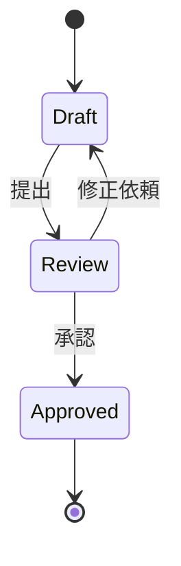

# MDXG 準拠ノート

このドキュメントは複数の H1 / H2 見出しを持ち、それぞれが仮想ページ (Virtual Page) になります。
右の「On this page」アウトラインには H3〜H6 が表示されます。

## レンダリング

### テーマ

ホスト OS のライト / ダークに追従します。ツールバー右上のトグルで `system → light → dark` を切り替えられます。

### コードブロック

Shiki でハイライトし、コピーボタンを提供します。言語指定のないブロックも等幅で表示されます。

### 表

| セクション | 要件レベル | 対応 |
| --- | --- | --- |
| Theming | MUST | ✅ |
| Code Block | MUST | ✅ |
| Virtual Pages | MUST | ✅ |
| Math | SHOULD | ✅ |
| Diagrams | SHOULD | ✅ |

## ドキュメント構造

### 仮想ページ

H1 (`#`) と H2 (`##`) の境界でページを分割します。コードフェンス内の見出しは境界として扱いません。

```md
# これはページ境界
## これもページ境界
### これはページ内見出し (アウトライン)
```

### ページナビゲーション

左サイドバーの「Pages」に、深さ (depth) のインデント付きで全ページが並びます。
矢印キー (↑ / ↓) と Enter で移動できます。

### 逐次ナビゲーション

ツールバーの ‹ Prev / Next › で前後のページへ移動します。先頭・末尾では非該当のボタンが無効になります。

## 検索

`Cmd/Ctrl + F` で検索バーを開きます。検索はレンダリング後の表示テキストに対して行われ、
`**bold**` のアスタリスクにはヒットしません。Enter / Shift+Enter で次 / 前のマッチへ移動し、
ページをまたいでも現在位置を保持します。

## 編集

### モード切り替え

- **Preview**: アクティブなページのみをレンダリング表示
- **Source**: ドキュメント全体の生 Markdown を Shiki ハイライト付きで編集

### ドキュメントリンク

`[welcome](welcome.md)` のような他の仕様書へのリンクは、アプリ内の同じビューアで開きます →
[ようこそページに戻る](welcome.md)。

## 数式とアルゴリズム

二分探索の計算量は $O(\log n)$ です。マージソートは次の漸化式に従います:

$$
T(n) = 2\,T\!\left(\frac{n}{2}\right) + \Theta(n) = \Theta(n \log n)
$$

```python
def binary_search(xs: list[int], target: int) -> int:
    lo, hi = 0, len(xs) - 1
    while lo <= hi:
        mid = (lo + hi) // 2
        if xs[mid] == target:
            return mid
        if xs[mid] < target:
            lo = mid + 1
        else:
            hi = mid - 1
    return -1
```

## 状態遷移図


