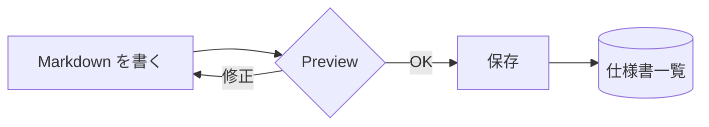
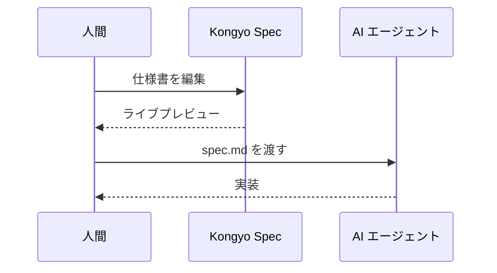

# Kongyo Spec へようこそ

**Kongyo Spec** は、AI 駆動開発のための Markdown 仕様書 (spec) を手で書くためのデスクトップエディタです。
左の一覧から仕様書を選び、ツールバーで **Preview** と **Source** を切り替えて編集します。

この最初のページは見出しの前に置かれた「導入 (Introduction)」コンテンツで、自動的に最初の仮想ページになります。

## GitHub Flavored Markdown

GFM のすべての構文に対応しています。

| 機能 | 構文 | 状態 |
| --- | :---: | ---: |
| テーブル | `\| a \| b \|` | 対応 |
| 打ち消し線 | `~~text~~` | 対応 |
| タスクリスト | `- [ ]` | 対応 |
| 自動リンク | `https://...` | 対応 |

- [x] GitHub-Markdown 完全互換
- [x] Shiki によるシンタックスハイライト
- [x] Mermaid 図のレンダリング
- [ ] あなたの最初の仕様書を書く

> 引用ブロックも美しく表示されます。~~取り消し線~~ や **強調**、_斜体_、`インラインコード` も混在できます。

脚注にも対応しています。[^mdxg]

[^mdxg]: この仕様書アプリは Markdown Experience Guidelines (MDXG) に準拠して設計されています。

## コードハイライト (Shiki)

フェンス付きコードブロックは Shiki でハイライトされ、ホバーでコピーボタンが現れます。

```ts
import { createHighlighter } from 'shiki';

const highlighter = await createHighlighter({
  themes: ['github-light', 'github-dark'],
  langs: ['typescript', 'tsx', 'json'],
});

export function render(code: string): string {
  return highlighter.codeToHtml(code, { lang: 'typescript', themes: { light: 'github-light', dark: 'github-dark' } });
}
```

```bash
npm install
npm run dev
```

## Mermaid 図





## 数式 (LaTeX / KaTeX)

インライン数式は $E = mc^2$ のように書けます。ガウス積分は $\int_{-\infty}^{\infty} e^{-x^2}\,dx = \sqrt{\pi}$ です。

ディスプレイ数式:

$$
\frac{\partial}{\partial t}\,\Psi(\mathbf{r}, t) = -\frac{i}{\hbar}\,\hat{H}\,\Psi(\mathbf{r}, t)
$$

$$
\begin{aligned}
\nabla \cdot \mathbf{E} &= \frac{\rho}{\varepsilon_0} \\
\nabla \times \mathbf{B} &= \mu_0 \mathbf{J} + \mu_0 \varepsilon_0 \frac{\partial \mathbf{E}}{\partial t}
\end{aligned}
$$

## 次の一歩

仕様書間のリンクもアプリ内で開きます → [MDXG 準拠ノート](mdxg-notes.md)。

外部リンクは既定のブラウザで開きます → [MDXG (GitHub)](https://github.com/vercel-labs/mdxg)。
